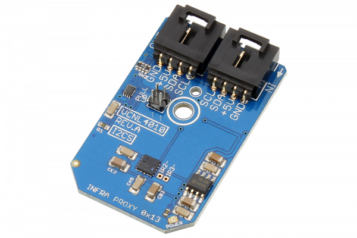

[](https://store.ncd.io/product/vcnl4010-proximity-and-ambient-light-sensor-with-infrared-emitter-0-25-lux-to-16k-lux-i2c-mini-module/).

#  VCNL4010

The VCNL4010 is a fully integrated proximity and ambient light sensor offering 16-bit resolution with an integrated signal processing IC, and features a standard I2C communication interface.The VCNL4010 can sense ambient light levels from 0.25 to 16K lux.
This Device is available from www.ncd.io 

[SKU: VCNL4010]

(https://store.ncd.io/product/vcnl4010-proximity-and-ambient-light-sensor-with-infrared-emitter-0-25-lux-to-16k-lux-i2c-mini-module/)
This Sample code can be used with Raspberry Pi.

Hardware needed to interface VCNL4010 proximity and ambient light sensor With Raspberry Pi :
1. <a href="https://store.ncd.io/product/vcnl4010-proximity-and-ambient-light-sensor-with-infrared-emitter-0-25-lux-to-16k-lux-i2c-mini-module/">VCNL4010 proximity and ambient light sensor</a>
2.  <a href="https://store.ncd.io/product/i2c-shield-for-raspberry-pi-3-pi2-with-outward-facing-i2c-port-terminates-over-hdmi-port/">Raspberry Pi I2C Shield</a>
3. <a href="https://store.ncd.io/product/i%C2%B2c-cable/">I2C Cable</a>

## Python
Download and install smbus library on Raspberry pi. Steps to install smbus are provided at:

https://pypi.python.org/pypi/smbus-cffi/0.5.1

Download (or git pull) the code in pi. Run the program.

```cpp
$> python VCNL4010.py
```
The lib is a sample library, you will need to calibrate the sensor according to your application requirement.
